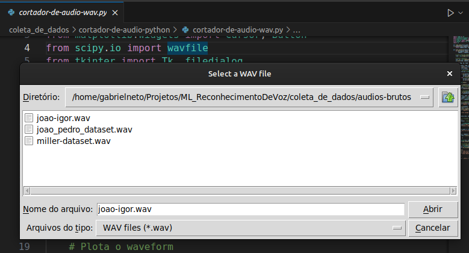
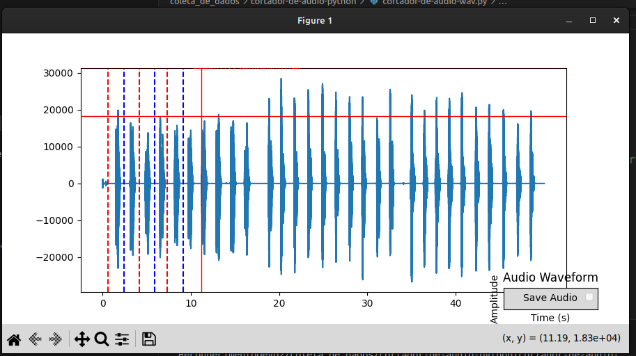
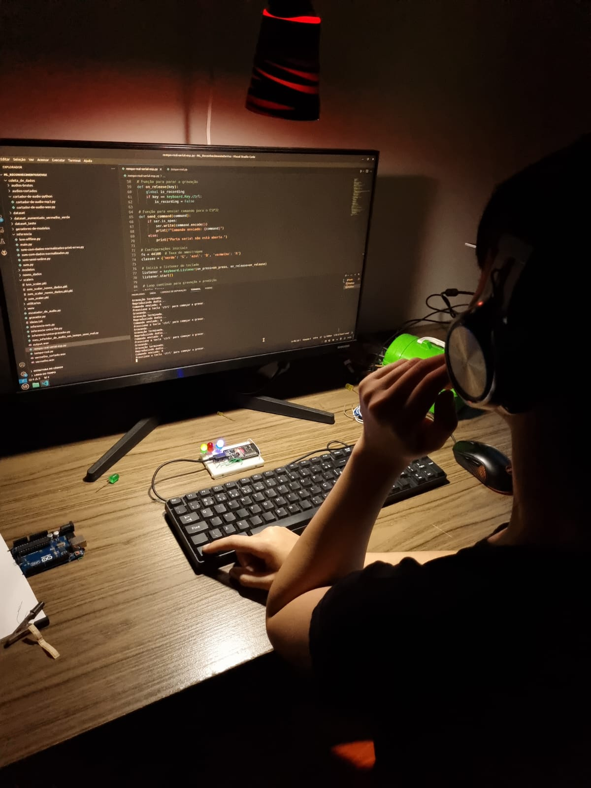
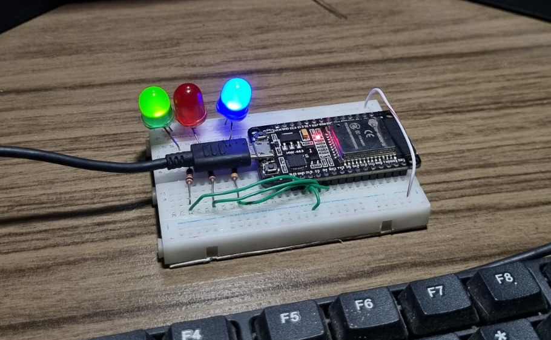

# Reconhecimento de Voz

O reconhecimento de comandos de voz é uma tecnologia que permite que sistemas computacionais interpretem e respondam a comandos dados por meio da fala humana. Utilizando algoritmos avançados de processamento de linguagem natural (PLN) e aprendizado de máquina, esse sistema converte o áudio da voz em texto, que pode então ser processado e executado por aplicativos ou dispositivos. A importância dessa tecnologia é ampla e crescente, impactando significativamente áreas como acessibilidade, onde permite que pessoas com deficiências físicas interajam com dispositivos de forma mais intuitiva, e automação, facilitando o controle de dispositivos e serviços através de comandos simples e naturais. Além disso, no campo da inteligência artificial, o reconhecimento de voz melhora a interação homem-máquina, tornando a tecnologia mais acessível e eficiente em diversas aplicações, desde assistentes pessoais digitais até sistemas de atendimento ao cliente. Em um mundo cada vez mais dependente de interfaces naturais e personalizadas, a evolução e a precisão do reconhecimento de voz desempenham um papel crucial na melhoria da experiência do usuário e na inclusão digital.

# Proposta deste trabalho

Este trabalho possui caráter acadêmico e integra a avaliação da terceira unidade da disciplina de Aprendizado de Máquina do IMD-UFRN. A proposta inicial consistia em desenvolver um sistema de reconhecimento de três comandos distintos em tempo real, sem a necessidade de utilizar algoritmos de Processamento de Linguagem Natural (PLN). Embora não tenha sido possível concluir a ideia original, os erros e acertos encontrados ao longo do processo resultaram na compilação de informações valiosas que podem ser de grande utilidade para alunos que pretendam empreender projetos semelhantes. Este trabalho, portanto, oferece uma visão prática e reflexiva sobre os desafios e soluções envolvidas no desenvolvimento de sistemas de reconhecimento de comandos de voz, contribuindo para o aprendizado e aprimoramento das práticas acadêmicas na área.

# Conteúdo teórico

# Metodologia

## Coleta de dados

A ideia deste projeto consiste em desenvolver um sistema capaz de diferenciar três palavras distintas: "vermelho", "verde" e "azul". Para atingir esse objetivo, foram coletados áudios gravados por aproximadamente 20 pessoas, de ambos os gêneros, cada um contendo várias repetições das palavras-alvo. Especificamente, foram coletadas 10 amostras de cada palavra por pessoa, totalizando cerca de 30 amostras por indivíduo. No total, foram obtidas aproximadamente 600 amostras, das quais 500 foram selecionadas após uma revisão de qualidade. É importante destacar que essa estratégia de coleta foi adotada para não sobrecarregar os voluntários que forneceram os áudios, uma vez que seria extremamente cansativo para eles gravar 30 áudios separados individualmente. O objetivo é utilizar essas amostras para treinar e avaliar o sistema de reconhecimento de comandos de voz.

## Preparação dos dados

Uma ideia inicial para o projeto foi cortar os áudios manualmente utilizando um software de edição gratuito. No entanto, esse processo revelou-se cansativo e demorado. Em resposta a essa dificuldade, foi desenvolvida uma aplicação em Python para agilizar o processo de edição. O aplicativo foi projetado para exibir um gráfico da intensidade sonora ao longo do tempo, permitindo a marcação de pontos específicos no gráfico que representavam os locais de corte dos áudios. Esses pontos de corte resultavam em arquivos de áudio menores e mais precisos. Apesar de ainda ser um processo manual, essa abordagem provou ser dezenas de vezes mais rápida do que cortar os áudios e exportar individualmente cada arquivo utilizando um software de edição tradicional. Além disso, o sucesso dessa metodologia foi possibilitado pelo cuidado prévio de instruir os voluntários a falarem pausadamente durante a gravação, o que facilitou a identificação e o corte preciso das amostras. Após o corte automático dos áudios, a etapa final consistia em renomear e armazenar os arquivos de forma adequada. Essa abordagem não apenas economizou tempo, mas também aumentou a eficiência na preparação dos dados para o treinamento do sistema de reconhecimento de comandos de voz.

### Interface do aplciativo de preparação dos dados

  Exemplo do uso da aplicação python selecionando o arquivo a ser cortado.

  Exemplo do uso da aplicação python selecionando os pontos de corte.

## Modelos de Inferencia 

Após o corte dos dados, a etapa seguinte consistiu na aplicação de dois modelos de aprendizado de máquina, K-Nearest Neighbors (KNN) e Support Vector Machine (SVM), com o objetivo de comparar seu desempenho. Vale destacar que, neste estágio, os algoritmos foram aplicados a dados pré-gravados, e não em tempo real, como originalmente pretendido no projeto. Para a inferência, foram extraídos 13 coeficientes de Mel-Frequency Cepstral Coefficients (MFCCs), que representaram de forma eficaz os dados e reduziram a dimensionalidade do problema.

Os modelos foram avaliados de várias maneiras, incluindo a divisão dos dados em conjuntos de treinamento e teste, bem como a coleta de novos dados de indivíduos diferentes para validação adicional. Além disso, foram testados em dados normalizados e não normalizados para avaliar a importância da normalização na classificação. Essa abordagem possibilitou uma análise detalhada do impacto da normalização no desempenho dos modelos de classificação, assim como a eficácia dos coeficientes MFCCs na representação dos dados.

## Ajustes

Os resultados obtidos na etapa anterior indicaram que duas classes, especificamente "verde" e "vermelho", apresentavam um nível significativo de similaridade, o que gerava erros frequentes na distinção entre elas. Em resposta a essa dificuldade, foram coletados novos dados específicos para essas duas classes. Esse procedimento resultou em uma redução considerável dos erros e em um aumento notável na precisão para a classificação dessas duas classes.

## Reconhecimento em tempo real
Nesta etapa, o objetivo foi implementar algoritmos capazes de reconhecer automaticamente trechos de fala em tempo real e classificá-los nas categorias "vermelho", "verde" ou "azul". No entanto, as primeiras tentativas revelaram que essa tarefa era mais desafiadora do que o esperado. Como resultado, a estratégia foi modificada para uma abordagem mais controlada: um único botão passou a ser utilizado para ativar o microfone e gravar o áudio enquanto a pessoa o mantinha pressionado. Ao soltar o botão, o programa normalizava o áudio, extraía as características e utilizava o modelo para realizar a inferência.

Embora essa abordagem tenha funcionado, ela apresentou um nível de confiança significativamente menor em comparação com os testes "offline" realizados com dados pré-gravados. Algumas hipóteses foram levantadas para explicar esse fenômeno, e essas serão detalhadas mais adiante. Além disso, serão discutidos cuidados importantes para aqueles que desejem replicar um experimento semelhante.

## "Validação" com circuito
Para tornar o projeto mais interativo, foi desenvolvido um circuito utilizando o ESP32, um microcontrolador amplamente empregado em diversos projetos. O papel do ESP32 é limitado a receber comandos do computador; ou seja, o processo de inferência é realizado pelo computador, que, com base nos resultados, envia o comando apropriado para o ESP32. Este, por sua vez, apenas executa a tarefa de alterar o estado do LED correspondente à cor do comando recebido. Assim, o ESP32 atua exclusivamente na parte de controle dos LEDs, enquanto a classificação e a lógica de comando são gerenciadas pelo computador.

  Circuito com ESP32 recebendo comandos do computador.

  Foto detalhada do circuito com ESP32

# Resultados

Durante o projeto, ficou evidente que realizar a inferência com dados pré-gravados — em contraste com a inferência em tempo real — resulta em uma precisão muito maior. Esse desvio na precisão ao usar dados em tempo real pode ser atribuído a dois problemas principais. Em primeiro lugar, ao gravar áudio com um microfone, é comum observar um pico de intensidade no início da gravação que se estabiliza após um breve período. Como os áudios de treinamento foram cortados para excluir esses picos, eles não estão representados nos dados de treinamento, o que faz com que tenham um impacto considerável na inferência em tempo real. Em segundo lugar, capturar exatamente o trecho de áudio correspondente apenas à voz em tempo real é extremamente desafiador, especialmente quando comparado ao processo manual de corte realizado nos áudios de treinamento.

Para efeitos práticos, o modelo tem apresentado um bom desempenho na classificação de áudio. No entanto, o principal desafio reside no tratamento do áudio antes da classificação, particularmente na adaptação do processo de gravação e pré-processamento para se alinhar com a precisão observada nos dados pré-gravados. De fato, para o mesmo áudio gravado previamente, é possível obter uma inferência correta após o corte manual, evidenciando a dificuldade de replicar a precisão do treinamento em condições de gravação ao vivo.